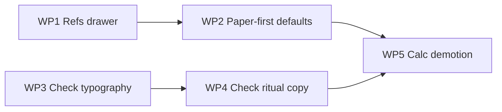

# Math Desk V2 — Tier 1 Execution Plan

**Status:** Implemented  
**Parent:** [math_desk_v2_identity_31b15bf6.plan.md](math_desk_v2_identity_31b15bf6.plan.md)  
**Goal:** First-time user reads: *"I write math here, and the line answers me."*

**Out of scope:** Σ Studio, notebook block architecture, persistence schema changes, AI, graph engine, OCR/PDF, Tier 2+.

---

## Files in scope (only these)

| File | Role |
|------|------|
| [`src/components/project-space/MathDeskPrototype.tsx`](src/components/project-space/MathDeskPrototype.tsx) | Layout: Refs flyout, defaults, header ritual copy, Calc demotion, handle chrome |
| [`src/lib/mathDesk/types.ts`](src/lib/mathDesk/types.ts) | Default collapse rule for `formula` zone |
| [`src/components/project-space/desk/DeskCheckRow.tsx`](src/components/project-space/desk/DeskCheckRow.tsx) | Response typography, ritual button, motion, whisper |
| [`src/lib/mathDesk/deskCheck.ts`](src/lib/mathDesk/deskCheck.ts) | Display strings only (`✓ balances`, `= N`, whisper prefix) |
| [`src/components/project-space/ProjectNotebookBlock.tsx`](src/components/project-space/ProjectNotebookBlock.tsx) | Desk empty-line placeholder copy only |
| [`src/components/project-space/desk/DeskCollapseHandle.tsx`](src/components/project-space/desk/DeskCollapseHandle.tsx) | Optional: quieter peripheral handles vs Refs |
| [`src/components/project-space/desk/DeskComputeBar.tsx`](src/components/project-space/desk/DeskComputeBar.tsx) | Copy/placeholder demotion only |

**Do not touch:** `ProjectNotebookBlock` block model, serialize/parse, `useSectionFreeSpaceObjects` schema, `DeskMiniGraph` plotting logic, Σ Studio, MathZone.

---

## Work packages (5 items, minimal path)

### WP1 — Refs on-demand drawer

**Current:** 168px left column when `formula` zone open; empty desk defaults **open** (`isDeskZoneCollapsed` returns `false` for formula when `formulas.length === 0`).

**Change:**

1. Remove the structural left column in `MathDeskPrototype` (the `width: FORMULA_PANEL` flex child).
2. Render `DeskFormulaMemory` inside the existing `flyoutPanel()` pattern (same as Plot/Calc), positioned `left: 8` (mirror right flyouts), width ~`TOOL_PANEL` or slightly wider (~180px) for formula cards.
3. Move `DeskCollapseHandle` for formula to the **left edge of the paper column** (inside the center flex child), same visual language as Plot/Calc on the right.
4. In `isDeskZoneCollapsed`: **default `formula` to collapsed always** (ignore card count). Explicit `deskLayout.collapsed.formula` still respected for user toggle.
5. Extend `toggleZone` mutual-exclusivity: opening Refs closes graph/compute flyouts (already closes other zones on open — verify formula included).
6. Keep badge on Refs handle = `formulas.length` when &gt; 0.

**Empty Refs drawer:** flyout shows compact empty state + “Add formula” (existing `DeskFormulaMemory` compact/adding flow), not a permanent column.

**Acceptance:** Empty desk has **zero** left column; Refs only appears after handle click.

---

### WP2 — Paper-first default (empty desk hierarchy)

**Current:** Formula open when empty; four handles same weight; placeholder `=> step or work…` only when starter-notebook heuristics match (often **not** shown on real empty desk).

**Change:**

1. WP1 delivers full-width paper by default.
2. In `ProjectNotebookBlock`, desk placeholder: when `deskFirstEmptyParaId` and line empty, always show:  
   `Write a step with numbers — ⌘↵ to hear the line answer`  
   (or shorter variant if line wraps badly). Drop dependency on `useStartWritingPlaceholder` for desk-only path.
3. In `MathDeskPrototype`, soften peripheral handles: lower opacity / thinner border on Plot, Calc, Scrap; Refs handle normal weight (or all peripherals equally **quiet** — Refs not louder than others).
4. No change to persisted `deskLayout` keys — only **default** when unset (WP1).

**Acceptance:** Open empty Math Desk → full paper, one instructional placeholder, four small edge tabs, no flyouts open.

---

### WP3 — Check response voice (stronger typography)

**Current:** Suffix 0.85em, ~72% opacity gray; ok = slight green; whisper 11px italic.

**Change in `deskCheck.ts` (copy only):**

| Outcome | New message |
|---------|-------------|
| Numeric | `= 4.243` (leading `=` not `→`) |
| Balances | `✓ balances` |
| Unsupported | keep `→ add numbers to check` / `→ can't evaluate` |
| Empty | `→ —` or omit on check of blank |
| Mismatch whisper | prefix `≠ ·` before existing left/right copy |

**Change in `DeskCheckRow.tsx` (presentation):**

- Response block: monospace, **1em** (match or +1px vs line), **opacity 1**, color ink-900 / high contrast on paper.
- Numeric / neutral: semibold `= value`.
- Ok: `✓ balances` in verified green (clearer than today).
- Separator: thin space or `·` between student text flex and response (layout unchanged, flex row).
- Whisper: 12px, not italic-only; `≠` visible; stale opacity unchanged.
- **Motion:** CSS `@keyframes` or transition — response opacity 0→1 over ~200ms when `state` goes from undefined → fresh (respect `prefers-reduced-motion`: instant).

**Acceptance:** `sqrt(2)*3` check reads as an **answer**, not linter gray text.

---

### WP4 — Check ritual visually central

**Current:** Header `⌘↵ check line` (9px ghost); line button `Check` (9px, 45% opacity).

**Change:**

1. **Header** (`MathDeskPrototype`):  
   `⌘↵ Check line` — slightly larger (10–11px), `textMuted` not ghost; `title` tooltip: “The line answers with numbers or balance”.
2. **Focused line** (`DeskCheckRow`):  
   Label → **`Check line`**; size 10px, weight 700, color ~muted-primary; optional subtle pill background on paper (1px border, 4px radius) so it scans as primary action on the row.
3. Do **not** add modals, toolbars, or auto-check.

**Acceptance:** Eye goes to problem hint + focused-line action before Refs/Calc handles.

---

### WP5 — Calc visually secondary to Check

**Current:** Calc handle identical to Plot; flyout same dark panel; placeholder `expression`.

**Change (presentation only, no feature removal):**

1. `DeskCollapseHandle`: add optional `variant: 'primary' | 'peripheral'` — Calc + Scrap + Plot use `peripheral` (smaller min-height, lower opacity label); Refs stays peripheral too.
2. `DeskComputeBar`: subtitle line under title: “Off-paper scratch — use **Check line** on your work”; placeholder `Side calculation (not your proof)`.
3. Do **not** hide Calc or merge Tools drawer (Tier 3).

**Acceptance:** Calc discoverable but clearly not the main way to validate work.

---

## Implementation order

1. **WP1** — largest layout win; unblocks paper-first.
2. **WP3 + WP4** — can ship together (check identity).
3. **WP2** — placeholder + handle quieting.
4. **WP5** — quick pass after layout stable.

Estimated touch surface: **~6 files**, no new components required (reuse `flyoutPanel` + `DeskFormulaMemory`).

---

## Regression checks (manual QA)

- [ ] Empty desk: full-width paper, no Refs column, all zones closed
- [ ] Refs open/close: flyout only; badge count; add/edit formula still works
- [ ] Plot/Calc: still open/close; opening one still closes others
- [ ] `sqrt(2)*3` → bold `= …` suffix
- [ ] `2+3=5` → `✓ balances`; `2+3=6` → `≠` whisper
- [ ] ⌘↵ and **Check line** button both work
- [ ] Edit line clears check (existing behavior)
- [ ] Classic notebook (`presentation !== desk`) unchanged
- [ ] Existing `deskLayout` persisted toggles still honored
- [ ] `prefers-reduced-motion`: no animation

---

## Success sentence (10-second test)

New user opens Math Desk → sees paper + “Write a step… ⌘↵” → types numbers → presses ⌘↵ → **line shows a clear answer** → can ignore Refs/Plot/Calc.

---

## Explicit deferrals (not Tier 1)

- Active-line left rail (Tier 2)
- Unified Tools menu (Tier 3)
- Paper “workbench” restyle (Tier 3)
- `deskCheck` logic changes beyond display strings
- Persistence / schema / notebook block types
