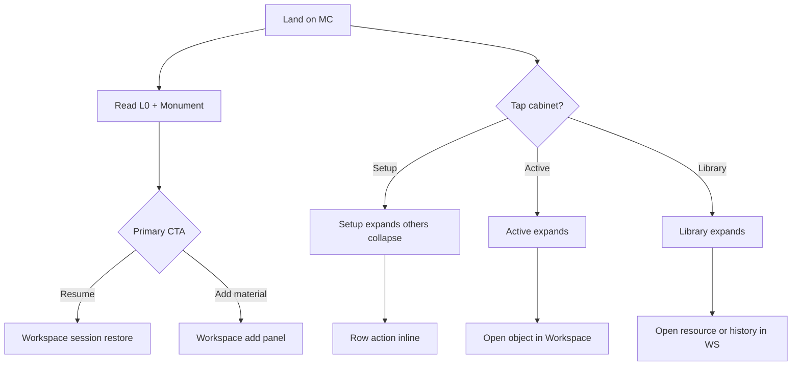

# Mission Control V1.1 — Wireframe Package

**Status:** Ready for prototype design  
**Reference:** [`mission-control-design-spec.md`](mission-control-design-spec.md) v1.1  
**Deliverable:** 10 screens + cabinet reference + self-review revisions

**Grid:** Desktop 1280×800 viewport · main column max 720px · left rail 248px · Mobile 390×844  
**Structure only:** no atmosphere, motion, or decorative chrome beyond 2px desk accent bar

---

## Global wireframe legend

```
[MC ●]     Mission Control tab selected
[WS ●]     Workspace tab selected
▸          Cabinet collapsed
▾          Cabinet expanded
▎          2px accent bar (desk zone)
───        Below-fold marker (~700px desktop)
wt NN%     Visual weight annotation
```

### Cabinet rules (all MC screens)

| Cabinet | Collapsed | Expanded max | Overflow |
|---------|-----------|--------------|----------|
| **Setup** | `▸ Setup (n)` — n = gap count, max display 2 inside | 2 rows + `+N more in setup` | Dismiss per row; +N opens remainder |
| **Active** | `▸ Active (n)` — hidden if n=0 | 5 rows in 3 groups | `View all in workspace →` |
| **Library** | `▸ Library` — **no count** | 8 Resources + 5 Recent study | Section ghost links |

**One cabinet expanded at a time.** Opening one collapses others.

### Dominance target (MC cold return)

Monument title 28% · desk frame 22% · CTA 12% · L0 8% · context/meta 10% · periphery 10% · cabinets 5% · nav 5%

---

# 1. Desktop — Cold Return (canonical)

## LAYOUT

```
┌─ LEFT RAIL 248px ──────────────┐┌─ MAIN 720px ─────────────────────────────────────────────┐
│ wt 10%                         ││ wt 90%                                                    │
│                                ││  Shell: [ Workspace ]  [ ● Mission Control ]  [ Studio ]   │
│  Quick links                   ││  ─────────────────────────────────────────────────────   │
│  Moodle              ↗         ││  📐 Macroeconomics                              ✦        │
│  Drive               ↗         ││                                                           │
│  ChatGPT             ↗         ││  L0  Exam in 9 days · You studied last night    wt 8%   │
│                                ││  ┌─ DESK ZONE ────────────────────────────────────────┐  │
│  ─────────                     ││  │▎ wt 50% (zone)                                       │  │
│  Dates                         ││  │▎  CONTINUE                              wt label    │  │
│  Problem set           3d      ││  │▎  Solow Model · Question 7            wt 28%     │  │
│  Macro exam            9d      ││  │▎  Final Exam 2023 · Page 4                          │  │
│                                ││  │▎  Work notebook · Block 12              wt 10%    │  │
│                                ││  │▎  Last active yesterday at 11:42pm                 │  │
│                                ││  │▎  ┌─────────────────────────┐                       │  │
│                                ││  │▎  │ Resume study session    │  wt 12%               │  │
│                                ││  │▎  └─────────────────────────┘                       │  │
│                                ││  │▎  Open workspace →                    wt ghost      │  │
│                                ││  └─────────────────────────────────────────────────────┘  │
│                                ││  STORAGE BAND  wt 5%                                      │
│                                ││  ▸ Setup (0)     ▸ Active (3)     ▸ Library                 │
│                                ││  ─ ─ ─ ─ ─ ─ ─ ─ below fold ─ ─ ─ ─ ─ ─ ─ ─ ─ ─ ─ ─   │
│                                ││  L3  tasks · capture · shelf                    wt recess   │
└────────────────────────────────┘└───────────────────────────────────────────────────────────┘
```

## ABOVE THE FOLD

| Visible | Collapsed | Hidden |
|---------|-----------|--------|
| Rail links + dates (4 max) | All cabinets | L3 tasks/shelf |
| Course title | | Setup expanded content |
| L0 whisper | | Library sections |
| Desk zone + monument + CTA | | Progress %, banners |

## CABINETS (cold arrival — all collapsed)

**Setup** `▸ Setup (0)` — no gaps or all dismissed  
**Active** `▸ Active (3)` — count only  
**Library** `▸ Library` — no count badge  

*(See Appendix A for expanded states)*

## MONUMENT

| Field | Value |
|-------|-------|
| Label | CONTINUE |
| Title | Solow Model · Question 7 |
| Context | Final Exam 2023 · Page 4 · Work notebook · Block 12 |
| Meta | Last active yesterday at 11:42pm |
| Primary CTA | Resume study session → crosses threshold, restores session |
| Secondary | Open workspace → (ghost) |

---

# 2. Desktop — Warm Return

**Landing surface: Workspace** (not MC). Delegate strip = ranker parity with cold monument.

## LAYOUT

```
┌─ WORKSPACE PRIMARY ──────────────────────────────────────────────────────────────────────────┐
│  Shell: [ ● Workspace ]  [ Mission Control ]  [ Studio ]                                      │
│  Canvas / StudySessionShell (restored — exam PDF + work notebook)              wt 85%        │
│  ─ ─ ─ ─ ─ ─ ─ ─ ─ ─ ─ ─ ─ ─ ─ ─ ─ ─ ─ ─ ─ ─ ─ ─ ─ ─ ─ ─ ─ ─ ─ ─ ─ ─ ─ ─ ─ ─ ─ ─ ─ ─   │
│  DELEGATE STRIP (fixed bottom or top, ≤8% viewport)                            wt 8%       │
│  ┌──────────────────────────────────────────────────────────────────────────────────────┐  │
│  │  18m ago  ·  Solow Model · Question 7  ·  Final Exam p.4          [ Resume ]        │  │
│  └──────────────────────────────────────────────────────────────────────────────────────┘  │
└────────────────────────────────────────────────────────────────────────────────────────────┘
```

**If user opens MC tab** (secondary wireframe note):

- L0: `Session active in Workspace`
- Monument mirrors strip content
- CTA: `Return to session`
- Cabinets: all collapsed

## ABOVE THE FOLD (Workspace)

| Visible | Collapsed | Hidden |
|---------|-----------|--------|
| Study session / canvas | MC cabinets | Delegate strip if session unambiguous |
| Delegate strip | | L3 on MC |

## MONUMENT (strip, not desk)

| Field | Value |
|-------|-------|
| Strip copy | 18m ago · Solow Model · Question 7 · p.4 |
| CTA | Resume (same verb as MC cold) |
| Parity rule | Title + action must match cold-return monument |

---

# 3. Desktop — New Course

## LAYOUT

```
┌─ RAIL ─────────────────────────┐┌─ MAIN ───────────────────────────────────────────────────┐
│  + Add Moodle                  ││  📐 Macroeconomics                              ✦        │
│  + Add Drive                   ││  L0  Welcome · Let's build your study space               │
│                                ││  ┌─ DESK ZONE ────────────────────────────────────────┐  │
│  Dates                         ││  │▎  START                                              │  │
│  (no exam date yet)             ││  │▎  Set up Macroeconomics                              │  │
│                                ││  │▎  Three things make a course ready: exam date,       │  │
│                                ││  │▎  your materials, and Moodle.                        │  │
│                                ││  │▎  Unfurnished desk                                  │  │
│                                ││  │▎  ┌─────────────────────────┐                       │  │
│                                ││  │▎  │ Add exam PDF            │                       │  │
│                                ││  │▎  └─────────────────────────┘                       │  │
│                                ││  │▎  Set up later →                                     │  │
│                                ││  └─────────────────────────────────────────────────────┘  │
│                                ││  ▸ Setup (3)     [Active hidden]     ▸ Library            │
│                                ││  ▾ Setup (3)  ← AUTO-EXPANDED ONCE                      │
│                                ││  ┌─────────────────────────────────────────────────────┐  │
│                                ││  │ ○ Add exam PDF                         Add →       │  │
│                                ││  │ ○ Set exam date                        Set →       │  │
│                                ││  │ ○ Connect Moodle                       Add →       │  │
│                                ││  └─────────────────────────────────────────────────────┘  │
│                                ││  ─ ─ ─ L3 HIDDEN ─ ─ ─                                  │
└────────────────────────────────┘└───────────────────────────────────────────────────────────┘
```

## ABOVE THE FOLD

| Visible | Collapsed | Hidden |
|---------|-----------|--------|
| Desk + START monument | Active (n=0) | L3 entirely |
| Setup **expanded** (once) | Library | Timeline in Library |
| Rail add prompts | | |

## MONUMENT

| Field | Value |
|-------|-------|
| Label | START |
| Title | Set up Macroeconomics |
| Context | Three things make a course ready… |
| CTA | Add exam PDF |
| Secondary | Set up later → |

---

# 4. Desktop — Empty Course

## LAYOUT

```
┌─ MAIN ─────────────────────────────────────────────────────────────────────────────────────┐
│  📐 Macroeconomics                                                              ✦          │
│  L0  No active study session                                                               │
│  ┌─ DESK ZONE ──────────────────────────────────────────────────────────────────────────┐  │
│  │▎  START                                                                              │  │
│  │▎  Add your first study material                                                      │  │
│  │▎  Drop an exam PDF or create a notebook to begin.                                    │  │
│  │▎  ┌─────────────────────────┐                                                       │  │
│  │▎  │ Add first material      │                                                       │  │
│  │▎  └─────────────────────────┘                                                       │  │
│  └──────────────────────────────────────────────────────────────────────────────────────┘  │
│  ▸ Setup (2)     [Active hidden]     ▸ Library                                             │
│  ▾ Setup (2)  ← expanded if gaps exist                                                   │
│  ┌─────────────────────────────────────────────────────────────────────────────────────┐  │
│  │ ○ Set exam date                                              Set →                 │  │
│  │ ○ Add Moodle link                                            Add →                 │  │
│  └─────────────────────────────────────────────────────────────────────────────────────┘  │
│  ─ ─ ─ L3 hidden until first material ─ ─ ─                                               │
└────────────────────────────────────────────────────────────────────────────────────────────┘
```

## MONUMENT

| Field | Value |
|-------|-------|
| Label | START |
| Title | Add your first study material |
| Context | Drop an exam PDF or create a notebook… |
| CTA | Add first material |
| Secondary | none (or Open workspace →) |

---

# 5. Desktop — Exam Week

**Same layout as Cold Return.** Copy and periphery tone only.

## LAYOUT delta vs Cold Return

| Element | Exam week change |
|---------|------------------|
| L0 | `Exam in 3 days · Pick up where you left off` (warmer `#94a3b8`, not red) |
| Rail exam line | Macro exam **3d** — slightly brighter, no badge |
| Monument | **Unchanged** — CONTINUE · Solow Model · Q7 |
| CTA | Resume study session |
| Cabinets | All collapsed |
| Forbidden | No banner, no progress %, no amber strip |

**Fallback (no study session):**

```
│  L0  Exam in 3 days · One task ready                                                       │
│  │▎  CONTINUE                                                                              │
│  │▎  Problem Set 4 · Question 2                                                           │
│  │▎  Exercises · Next incomplete                                                          │
│  │▎  ┌─────────────────────────┐                                                          │
│  │▎  │ Start focus session     │                                                          │
│  │▎  └─────────────────────────┘                                                          │
```

---

# 6. Mobile — Cold Return

## LAYOUT

```
┌──────────────────────────── 390px ────────────────────────────┐
│  Shell: Workspace | ● MC | Studio                    wt 5%   │
│  📐 Macroeconomics                                    ✦      │
│  L0  Exam in 9 days · Last night                      wt 8%  │
│  ┌─ DESK ZONE full width ────────────────────────────────┐   │
│  │▎  CONTINUE                                             │   │
│  │▎  Solow Model · Question 7                   wt 28%    │   │
│  │▎  Final Exam 2023 · Page 4 · Block 12                 │   │
│  │▎  Last active yesterday at 11:42pm                    │   │
│  │▎  ┌─────────────────────────────────────────────────┐  │   │
│  │▎  │        Resume study session          wt 12%   │  │   │
│  │▎  └─────────────────────────────────────────────────┘  │   │
│  │▎  Open workspace →                                      │   │
│  └─────────────────────────────────────────────────────────┘   │
│  wt 50% desk zone                                              │
│  ─ ─ ─ compact periphery ─ ─ ─                                 │
│  Moodle ↗   Drive ↗   Exam 9d                         wt 8%  │
│  STORAGE BAND — single row, may wrap                           │
│  ▸ Setup (0)   ▸ Active (3)   ▸ Library                 wt 5%│
│  ─ ─ ─ scroll ─ ─ ─                                            │
│  L3 tasks · shelf (below fold)                                 │
└────────────────────────────────────────────────────────────────┘
```

## MOBILE rules

- CTA **full width**, min 44px height
- Monument title 20px (not 24px)
- Periphery: one row, not rail
- Scroll: desk + cabinets above fold; L3 below
- Hierarchy preserved: desk ≥45% of initial viewport

---

# 7. Mobile — Warm Return

## LAYOUT

```
┌──────────────────────────── 390px ────────────────────────────┐
│  [ ● Workspace ]  MC  Studio                                   │
│  ┌─ STUDY SESSION / CANVAS ────────────────────────────────┐   │
│  │  (full viewport — restored session)              wt 88% │   │
│  └─────────────────────────────────────────────────────────┘   │
│  ┌─ DELEGATE STRIP ────────────────────────────────────────┐   │
│  │ Solow · Q7 · 18m ago              [ Resume ]      wt 8% │   │
│  └─────────────────────────────────────────────────────────┘   │
└────────────────────────────────────────────────────────────────┘
```

Strip: single line + full-width Resume button on narrow screens.

---

# 8. Mobile — New Course

## LAYOUT

```
┌──────────────────────────── 390px ────────────────────────────┐
│  📐 Macroeconomics                                             │
│  L0  Welcome · Let's build your study space                    │
│  ┌─ DESK ZONE ─────────────────────────────────────────────┐  │
│  │▎ START · Set up Macroeconomics                            │  │
│  │▎ Three things make a course ready…                        │  │
│  │▎ [ Add exam PDF ]  full width                            │  │
│  │▎ Set up later →                                           │  │
│  └───────────────────────────────────────────────────────────┘  │
│  Moodle ↗  + Add Moodle                                        │
│  ▾ Setup (3)                                                   │
│  ○ Add exam PDF                                    Add →      │
│  ○ Set exam date                                   Set →      │
│  ○ Connect Moodle                                  Add →      │
│  ▸ Library                                                     │
│  (L3 hidden)                                                   │
└────────────────────────────────────────────────────────────────┘
```

**Mobile revision:** Setup expanded **below** desk, not competing with monument height — scroll if Setup + desk exceed 60% viewport.

---

# 9. Mobile — Empty Course

Same structure as New Course with:

- L0: `Let's get this course ready`
- Monument: `Add your first study material`
- CTA: `Add first material`
- Setup `(2)` max 2 rows expanded
- Active hidden

---

# 10. Mobile — Exam Week

Same as Mobile Cold Return with L0 `Exam in 3 days · Pick up where you left off` and warmer exam chip in periphery row. Monument unchanged.

---

# APPENDIX A — Cabinet expanded reference (any MC screen)

## Setup expanded

```
▾ Setup (2)
┌──────────────────────────────────────────────────────────────┐
│ ○ Add exam PDF                                    Add →     │
│ ○ Set exam date                                   Set →     │
│ +1 more in setup                                             │
└──────────────────────────────────────────────────────────────┘
Max 2 visible · dismiss (×) per row · ○ not ⚠
```

## Active expanded

```
▾ Active (3)
┌──────────────────────────────────────────────────────────────┐
│ On your desk                                                 │
│   Final Exam 2023 + Work notebook                 last night  │
│ Nearby                                                       │
│   Slides PDF                                      2d ago    │
│ Needs review                                                 │
│   Lagrange mistake                                4d ago    │
│ View all in workspace →                                      │
└──────────────────────────────────────────────────────────────┘
Max 5 rows · groups labeled · no filenames as raw paths
```

## Library expanded

```
▾ Library
┌──────────────────────────────────────────────────────────────┐
│ Resources                                                    │
│   Exams                                                      │
│     Final Exam 2023                               Open →    │
│   Links                                                      │
│     Moodle                                        ↗         │
│   View all in workspace →                                    │
│                                                              │
│ Recent study                                                 │
│   Yesterday · Solow Model · Q7 · 42m                        │
│   Tue · Problem Set 3 notebook · 18m                        │
│   View full history in workspace →                           │
└──────────────────────────────────────────────────────────────┘
Max 8 Resources + 5 Timeline · Timeline hidden until events exist
```

---

# APPENDIX B — Interaction flows



---

# SELF REVIEW

## Initial critique

| Risk | Finding |
|------|---------|
| **Dashboard creep** | New Course with Setup expanded + 3 rows below desk approaches checklist UI above fold |
| **Hierarchy failure** | Desktop rail splits attention with desk; mobile periphery row after desk adds a fourth horizontal band |
| **Visual clutter** | Three cabinet triggers on one line + compact links row = 2 metadata strips below monument |
| **Mobile weakness** | New Course: Setup expanded under desk may push monument below 45% on small phones |
| **Warm return** | Strip could compete with session chrome if placed top — must stay thin bottom |
| **Library** | Expanded pane long (8+5 rows) — scroll inside cabinet only, not page |

## Revisions applied (wireframe v1.1.1)

| Issue | Revision |
|-------|----------|
| New Course clutter | **Rev 1:** On New Course only, Setup auto-expand uses **max 2 visible** (third gap in +1 more) — matches Mess Detector cap, reduces height |
| Mobile hierarchy | **Rev 2:** Mobile periphery row moves **above** storage band, **below** desk — order: Desk → Links row → Cabinets |
| Cabinet strip | **Rev 3:** Mobile cabinets stack **vertically** on `<360px` — one trigger per line, left-aligned |
| Warm strip | **Rev 4:** Strip fixed **bottom** of Workspace, 56px max height, single line + button |
| Exam week | **Rev 5:** Periphery exam emphasis = **bold weight only**, no color change in wireframes |
| Secondary CTA | **Rev 6:** Cold return keeps ghost link; Empty/New omit secondary if CTA is clear |

### Revised Mobile Cold Return (v1.1.1)

```
┌──────────────────────────── 390px ────────────────────────────┐
│  📐 Macroeconomics                                             │
│  L0  Exam in 9 days · Last night                              │
│  ┌─ DESK ZONE ─────────────────────────────────────────────┐  │
│  │▎ CONTINUE · Solow Model · Question 7                     │  │
│  │▎ …context · meta…                                        │  │
│  │▎ [ Resume study session ]  full width                     │  │
│  │▎ Open workspace →                                         │  │
│  └───────────────────────────────────────────────────────────┘  │
│  Moodle ↗  Drive ↗  Exam 9d          ← periphery AFTER desk    │
│  ▸ Setup (0)                                                    │
│  ▸ Active (3)                                                   │
│  ▸ Library              ← stacked if narrow                     │
│  ─ ─ scroll ─ ─                                               │
│  L3                                                             │
└────────────────────────────────────────────────────────────────┘
```

### Revised New Course Setup (v1.1.1)

```
▾ Setup (2)
│ ○ Add exam PDF                         Add →
│ ○ Set exam date                        Set →
│ +1 more in setup  (Moodle)
```

---

# PACKAGE CHECKLIST

| # | Screen | Desktop | Mobile | Status |
|---|--------|---------|--------|--------|
| 1 | Cold return | §1 | §6 + Rev | Ready |
| 2 | Warm return | §2 | §7 + Rev | Ready |
| 3 | New course | §3 + Rev | §8 + Rev | Ready |
| 4 | Empty course | §4 | §9 | Ready |
| 5 | Exam week | §5 | §10 | Ready |
| — | Cabinets expanded | Appendix A | Appendix A | Ready |
| — | Interaction | Appendix B | Appendix B | Ready |

---

**Mission Control V1.1 Wireframe Package — ready for prototype design.**

**Visual wireframes:** [`docs/wireframes/mission-control-v1.1.html`](../wireframes/mission-control-v1.1.html) — open in browser for interactive desktop/mobile states.

*End of wireframe package v1.1.1*
